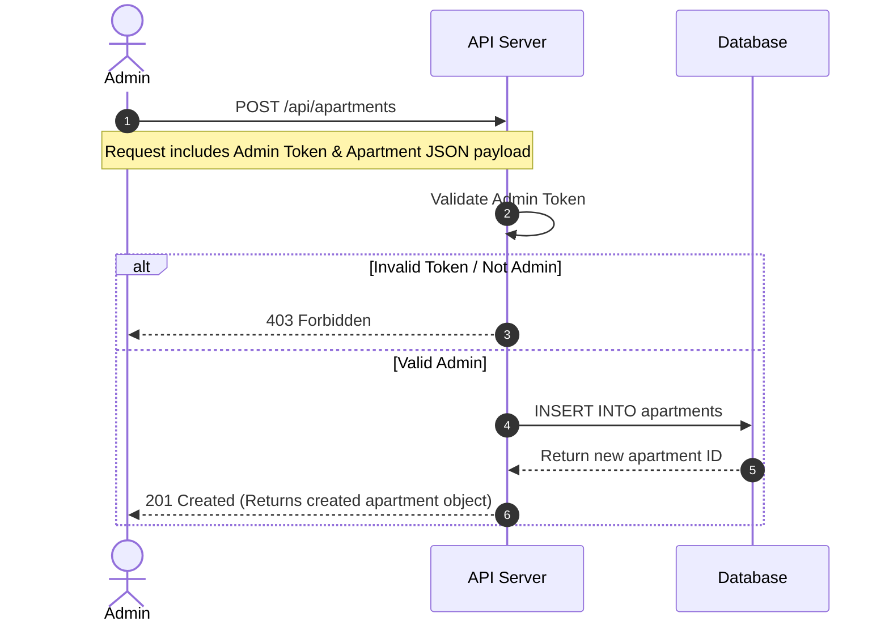

```mermaid
sequenceDiagram
    autonumber
    actor Admin
    participant API as API Server
    participant DB as Database

    Admin->>API: POST /api/apartments
    Note over Admin,API: Request includes Admin Token & Apartment JSON payload
    
    API->>API: Validate Admin Token
    alt Invalid Token / Not Admin
        API-->>Admin: 403 Forbidden
    else Valid Admin
        API->>DB: INSERT INTO apartments
        DB-->>API: Return new apartment ID
        API-->>Admin: 201 Created (Returns created apartment object)
    end
```