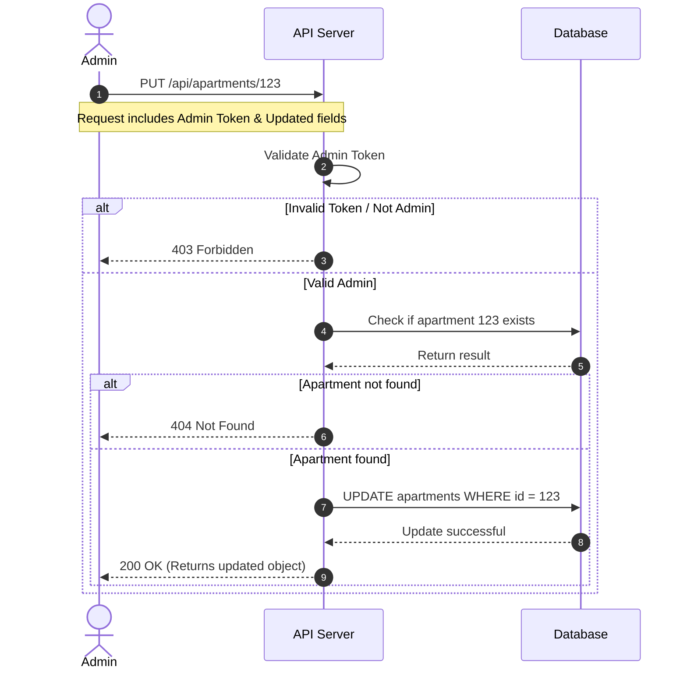

```mermaid
sequenceDiagram
    autonumber
    actor Admin
    participant API as API Server
    participant DB as Database

    Admin->>API: PUT /api/apartments/123
    Note over Admin,API: Request includes Admin Token & Updated fields
    
    API->>API: Validate Admin Token
    alt Invalid Token / Not Admin
        API-->>Admin: 403 Forbidden
    else Valid Admin
        API->>DB: Check if apartment 123 exists
        DB-->>API: Return result
        
        alt Apartment not found
            API-->>Admin: 404 Not Found
        else Apartment found
            API->>DB: UPDATE apartments WHERE id = 123
            DB-->>API: Update successful
            API-->>Admin: 200 OK (Returns updated object)
        end
    end
    
```