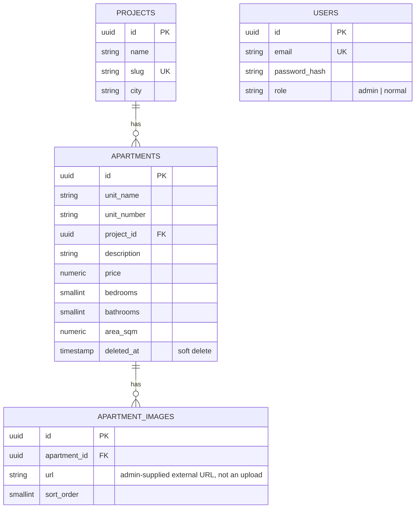

> Updated to match what shipped (see root `README.md` → "Deviations from
> `InitialSystemDesign/`" for the full list and reasoning). Original draft
> had a flat `apartments.project` string and a single `image` field —
> shipped with `projects` normalized into its own table and images as a
> one-to-many `apartment_images` table.

