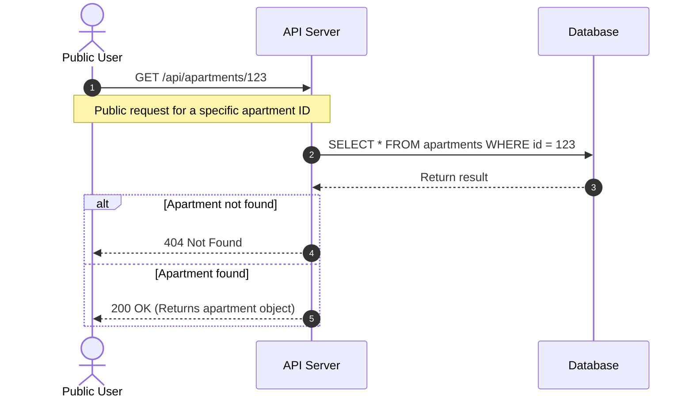

```mermaid
sequenceDiagram
    autonumber
    actor User as Public User
    participant API as API Server
    participant DB as Database

    User->>API: GET /api/apartments/123
    Note over User,API: Public request for a specific apartment ID
    
    API->>DB: SELECT * FROM apartments WHERE id = 123
    DB-->>API: Return result
    
    alt Apartment not found
        API-->>User: 404 Not Found
    else Apartment found
        API-->>User: 200 OK (Returns apartment object)
    end
```