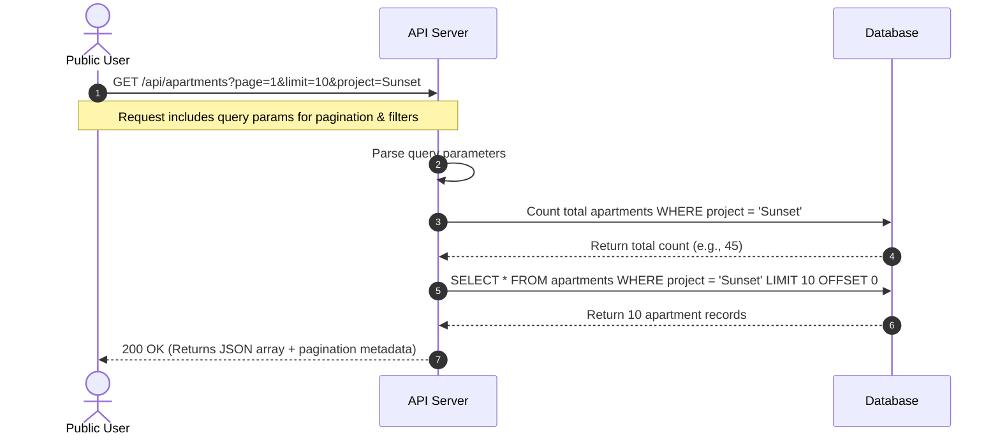

```mermaid
sequenceDiagram
    autonumber
    actor User as Public User
    participant API as API Server
    participant DB as Database

    User->>API: GET /api/apartments?page=1&limit=10&project=Sunset
    Note over User,API: Request includes query params for pagination & filters
    
    API->>API: Parse query parameters
    
    API->>DB: Count total apartments WHERE project = 'Sunset'
    DB-->>API: Return total count (e.g., 45)
    
    API->>DB: SELECT * FROM apartments WHERE project = 'Sunset' LIMIT 10 OFFSET 0
    DB-->>API: Return 10 apartment records
    
    API-->>User: 200 OK (Returns JSON array + pagination metadata)
```