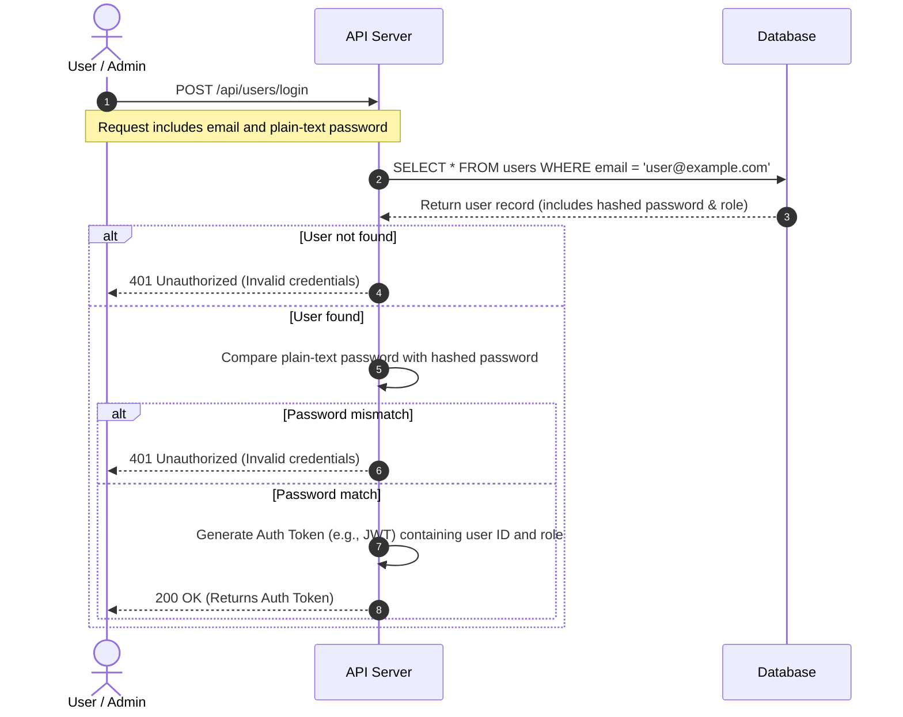

```mermaid
sequenceDiagram
    autonumber
    actor User as User / Admin
    participant API as API Server
    participant DB as Database

    User->>API: POST /api/users/login
    Note over User,API: Request includes email and plain-text password
    
    API->>DB: SELECT * FROM users WHERE email = 'user@example.com'
    DB-->>API: Return user record (includes hashed password & role)
    
    alt User not found
        API-->>User: 401 Unauthorized (Invalid credentials)
    else User found
        API->>API: Compare plain-text password with hashed password
        
        alt Password mismatch
            API-->>User: 401 Unauthorized (Invalid credentials)
        else Password match
            API->>API: Generate Auth Token (e.g., JWT) containing user ID and role
            API-->>User: 200 OK (Returns Auth Token)
        end
    end
```