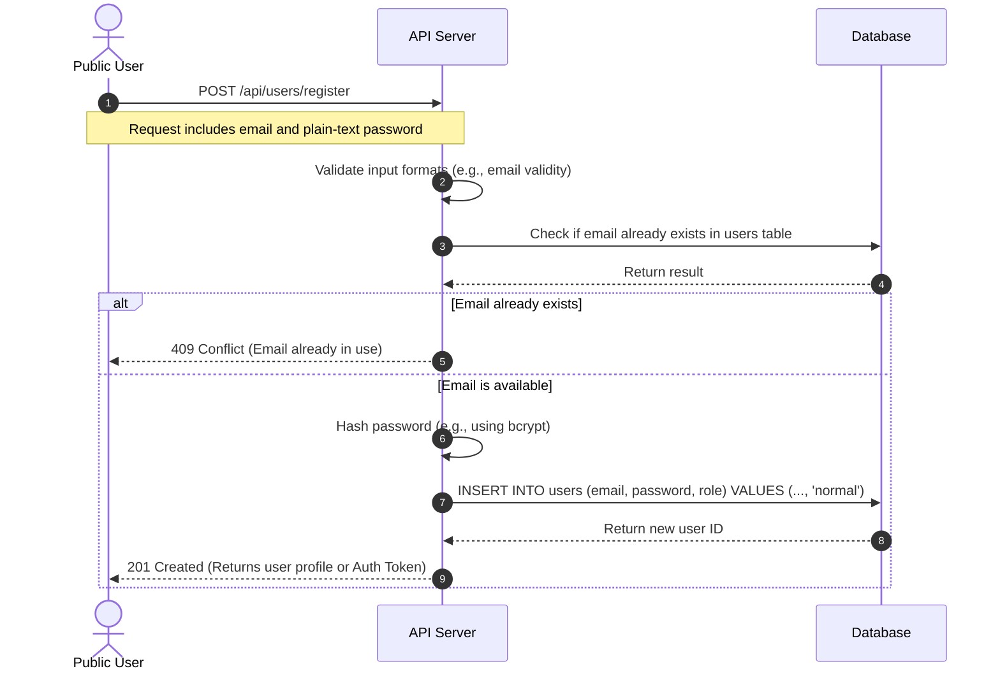

```mermaid
sequenceDiagram
    autonumber
    actor User as Public User
    participant API as API Server
    participant DB as Database

    User->>API: POST /api/users/register
    Note over User,API: Request includes email and plain-text password
    
    API->>API: Validate input formats (e.g., email validity)
    
    API->>DB: Check if email already exists in users table
    DB-->>API: Return result
    
    alt Email already exists
        API-->>User: 409 Conflict (Email already in use)
    else Email is available
        API->>API: Hash password (e.g., using bcrypt)
        API->>DB: INSERT INTO users (email, password, role) VALUES (..., 'normal')
        DB-->>API: Return new user ID
        API-->>User: 201 Created (Returns user profile or Auth Token)
    end
```